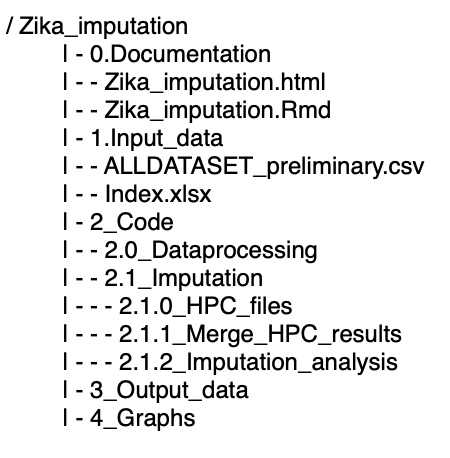

<script>
   $(document).ready(function() {
     $head = $('#header');
     $head.prepend('')
   });
</script>


```{r setup, include=FALSE}
knitr::opts_chunk$set(echo = TRUE)
```

# 0. Introduction `r emo::ji("book")`

The output of the harmonization procedure is a individual participant dataset that includes the information of all studies included in the Zika project. This dataset contains some variables that could be sporadically missing due to a study specific missing process or systematically missing when variable information was not fully recorded on a particular study.

The presence of missing data could lead to biased estimates and erroneous conclusions of the analysis. Therefore it is necessary to apply an imputation process that helps us to minimize the impact of missingness in our analysis before to proceed with the analysis established in the protocol. 

The imputation process that we propose contains the following steps:

0. Data Preprocessing
- Data exploration.
- Data correction.
- Deductive imputation. 
- Creation of additional variables. 
1. Imputation process
- Selection of variables in the imputation model. 
- Setting of imputation methods. 
- Post processing. 
- Setting or additional imputation parameters. 
- Convergence evaluation.
- Sensitivity analysis.


Below we provide specific details on each step providing simultaneously the R code and results. 

# 0.0. Folder structure `r emo::ji("folder")`
All the information of our work is resumed in the following folder tree structure. We used rstudioapi package that will facilitate the load and saving process of certain files across the process. 




In folder '0. Documentation' this Rmarkdown code is saved along with its html version. 
Inside the folder '1. input data', the data file resulting from the harmonization process in a R.Data format and a xlsx file with the list of relevant variables selected by experts in the field are saved.
The code folder contains the original R code for the data processing, for imputation process (including the codes to sent to High Performance Computer (HPC) and to merge the resulting iterations) and analysis. 
Relevant output files and graphs are saved in 3. Output data and 4. Graphs folders. 

# 1. Data exploration `r emo::ji("magnifying")`

## 1.0. Load resources
### 1.0.0. Load packages `r emo::ji("package")`
Initially we load the R package that we will use across the imputation process

```{r, message=FALSE,warning=FALSE}
rm(list=ls()) # clean environment

# Data manipulation packages
library(here) 
library(data.table)
library(dplyr)

# Imputation packages
library(mitml)
library(mice)
library(micemd)
library(miceadds)

# Graphic packages
library(corrplot)
library(ggplot2)
library(ggtext)
library(plotly)

# Field specific package
library(growthstandards)
```

### 1.0.1. Load dataset and other sources of information `r emo::ji("desktop")`

The here package allows us to define the relative paths of each of subfolders. So authors do not require to define own paths. Once the file is placed in the right folder, it can be loaded automatically.

```{r}

data <- as.data.table(read.csv(here('1_Input_data','pilot10_08SEP21_withmetadata.csv'), stringsAsFactors=FALSE, fileEncoding="latin1"))
infoexp <- as.data.table(readxl::read_xlsx(here('1_Input_data','Infoexp.xlsx'),sheet="Table")) #CSV file with the outcome, exposure and pregnant women from "20-20-20 key variables - ZIKV IPD-MA_June 7 2021.xlsx", same info but better to manipulate in R. 
var_inc<-infoexp[Inclusion==1,Variable] #Variables to work with
data<-as.data.table(data[,..var_inc]) #Filter dataset
```

## 1.1. Initial data cleanup

Initially we check the dataset to identify possible typing errors and outliers. We check the tree group of input variables: Outcome, Exposure, Pregnant woman.

### 1.1.0. Check the format of categorical variables
```{r}
char <- which(sapply(data, is.character)) #which are characters
datac <- data[,..char]
data[, inf_head_circ_age_fu1 := as.numeric(sub(" .*", "",data$inf_head_circ_age_fu1))] # remove years
data[, zikv_elisa_ga_1 := as.numeric(sub(" .*", "",data$zikv_elisa_ga_1))] #remove observations with weeks written
data[ zikv_pcr_date_1 %in% c("22027","888",""), zikv_pcr_date_1 := NA] # set as NA values not given in date format
data[ zikv_elisa_date_1 %in% c(""),zikv_elisa_date_1 := NA] #set blank strings as NA 
data[ symp_date%in%c(""), symp_date:=NA]
data[, arb_clindiag := ifelse(arb_clindiag==777,6,arb_clindiag)] # We set the NA value ("777") to a level "6" because we later use it to define the CZS variable
```

### 1.1.1. Redefine NA values

We know that the harmonization team categorized the NA values to better understand the data, however for practical purposes and application of imputation methods we need to set up all the 666,777,888,999 values to NA. R does not manage NA values in the same way as SAS does, and specifically mice only handles NA values.
```{r}
data[data == 666] <-  NA
data[data == 777] <-  NA
data[data == 888] <-  NA
data[data == 999] <-  NA
data[data == 9999] <-  NA
data[,Comb_id:=paste(studyname,mid_original,childid_original,sep="-")] #combinated ID from study mother and child id

```
### 1.1.2. Set NA to implausible values
We used as boundaries the values listed in the Plausible_values file for continuos and time related variables, so any value out of the plausible range is set to NA.
```{r}
Boundaries<-infoexp[Inclusion==1&Vtype%in%c("C","T"),c("Type","Variable","Vtype","Units","Min","Max")]
Boundaries[,Max:=ifelse(is.na(Max),"Inf",Max)]
boundvar=Boundaries$Variable
for(var in boundvar){
  data$var_bound<-data[,..var]
  Min=as.numeric(Boundaries[Variable==var]$Min)
  Max=as.numeric(ifelse(is.na(Boundaries[Variable==var]$Max),1/0,Boundaries[Variable==var]$Max))
  data[var_bound<=Min|var_bound>=Max,(var):=NA]
}  

```
### 1.1.2. Check outcome variables

```{r}
#unique(data$othabnorm_spec) # 39 categories 
data[,othabnorm_spec := NULL] # We temporally remove it from dataset as it is messy: 39 categories in total
data[,endga := ifelse(!is.na(endga),endga,birth_ga)] #end_ga has same values as birth_ga.
data[fet_us_micro_tri2 == 1|fet_us_micro_tri3 == 1, microcephaly_bin := 1]
```


### 1.1.3. Check exposures

By checking the inclusion criteria of each study it was found that the following studies only included women with detected zika infection (Source: Lauren code)
- Brazil_BahiaPaudaLima_Costa
- Brazil_SP_RibeiraoPreto_Duarte 
- TrinidadTobago_Sohan

Therefore the zika prevalence (zikv_prev) can be set to 1 for all women belonging to these studies.
Note: According to the metadata, probably the following countries only include women with ZIKA infection:
- Brazil_RiodeJaneiro_CunhaPrata
- Spain_Soriano
- FrenchGuiana_Pomar
- Colombia_Mulkey
However by inspecting the data we found that in these countries there is a high proportion of women with a negative zikv_preg = 0 (zikv_neg).

```{r}
zik_incA<-c("Brazil_RiodeJaneiro_CunhaPrata","Brazil_SP_RibeiraoPreto_Duarte","Brazil_BahiaPaudaLima_Costa","Spain_Soriano","FrenchGuiana_Pomar","TrinidadTobago_Sohan","Colombia_Mulkey")

data[, .(count = .N,
                ziv_pos=sum(ifelse(zikv_preg==1,1,0),na.rm=TRUE),
                ziv_neg=sum(ifelse(zikv_preg==0,1,0),na.rm=TRUE),
                ziv_na=sum(ifelse(is.na(zikv_preg),1,0),na.rm=TRUE),
                inclusion=ifelse(studyname%in%zik_incA,1,0))
                , by = studyname] 
                
    
```     
We opted just to apply the inclusion criteria according to Lauren list
```{r}
zik_inc<-c("Brazil_RiodeJaneiro_CunhaPrata","Brazil_SP_RibeiraoPreto_Duarte","TrinidadTobago_Sohan")
data[studyname%in%zik_inc,zik_preg:=1]
```

Observations without a defined date of zika test, but with a date for pcr or elisa test were assigned with the earlier date of the available test dates.

```{r,warning=FALSE}
data[, zikv_ga_min:=apply(data[,c("zikv_elisa_ga_1","zikv_pcr_ga_1")], 1, min, na.rm = TRUE)]
data[, zikv_ga_min:=ifelse(is.infinite(zikv_ga_min),NA,zikv_ga_min)]
data[, zikv_gan:=ifelse(is.na(zikv_ga),zikv_ga_min,zikv_ga_min)]
data[, zikv_gan:=ifelse(is.na(zikv_ga),zikv_ga_min,zikv_ga_min)]
data[, zikv_ga_min:=NULL]
data[, zikv_trin:=ifelse(is.na(zikv_gan),zikv_tri,ifelse(zikv_gan<13,0,ifelse(zikv_gan<=27,1,2)))]

checktable<-as.data.table(table(elisa=data$zikv_elisa_res_1,
                              elisa_everpos=data$zikv_elisa_everpos,
                              pcr=data$zikv_pcr_res_1,
                              zikv_preg=data$zikv_preg,
                              arb_cli=data$arb_clindiag,
                              useNA = "always"))
checktable[N>0] #ask for observations where zik value 0 and other there is 1 aroun 273..which has more priority on information?
```

### 1.1.4.Check Pregnant woman variables
```{r}
data[tobacco==3,tobacco:=NA] # level not defined
```

# 2. Data correction

## 2.0. Microcephaly correction
```{r}
data[!is.na(inf_sex), hcircm2zscore := as.numeric(igb_hcircm2zscore(gagebrth = birth_ga*7,
                                                                    hcircm=inf_head_circ_birth,
                                                                    sex=ifelse(inf_sex== 0, "Male","Female")))]  
data[, microcephaly_temp := ifelse(hcircm2zscore<=-3,2,
                            ifelse(hcircm2zscore<=-2,1,
                            ifelse(hcircm2zscore<=2,0,
                            ifelse(!is.na(hcircm2zscore),3,NA))))]

data[ is.na(microcephaly), microcephaly := microcephaly_temp]
check_microcephaly <- as.data.table(table(mic_bin=data$microcephaly_bin,
                                          micro=data$microcephaly,
                                          micro_temp=data$microcephaly_temp,
                                          useNA = "always"))
check_microcephaly[N>0]  #check this inconsistency.. we prioritized microcephaly variable 
data[,microcephaly_bin:=ifelse(microcephaly%in%c(0,3),0,ifelse(microcephaly%in%c(1,2),1,microcephaly_bin))]
```

## 2.1. Calculate postnatal microcephaly
In order to calculate the microscephaly z score we used the who_hcirm2zcore that provide the scores according WHO definitions. It is necessary to remark that the zscore of follow up measurements taken after 61 months were set to NA as time values are outside the range of the WHO standards.

```{r}
for(t in 1:3){
  microvar<-paste0("microcephaly_bin_fu",t)
  var_age<-paste0("inf_head_circ_age_fu",t)
  var_circ<-paste0("inf_head_circ_age_fu",t)
  data$age_fu=data[,..var_age]*30
  data$hcirc_fu=data[,..var_circ]
  data[!is.na(inf_sex), hcircm2zscore_fu:=as.numeric(who_hcircm2zscore(agedays =age_fu, hcircm=hcirc_fu,sex=ifelse(inf_sex== 0, "Male","Female")))]  
  data[,micro_fu:= ifelse(hcircm2zscore_fu<=-3,2,ifelse(hcircm2zscore_fu<=-2,1,ifelse(hcircm2zscore_fu<=2,0,ifelse(!is.na(hcircm2zscore_fu),3,NA))))]
  data[,micro_bin_fu:=ifelse(micro_fu%in%c(0,3),0,ifelse(micro_fu%in%c(1,2),1,NA))]
  data[, (microvar):= micro_bin_fu]
}
data[,postsum:=rowSums(data[,c("microcephaly_bin_fu1","microcephaly_bin_fu2","microcephaly_bin_fu3")],na.rm=T)]
data[,microcephaly_posn:=ifelse(is.na(microcephaly_bin_fu1)&is.na(microcephaly_bin_fu2)&is.na(microcephaly_bin_fu3),NA,ifelse(postsum>0&microcephaly_bin==0,1,0))]

```

# Notes @Anneke
No idea how to add the microcephaly_posn in the czsn value...

## 2.2. CZS correction
To facilitate the construction of abnormality variables we created the following function
```{r}
#Function returns 1 if there is any anomaly detected and 0 if there were no anomaly detected across the recorded variables, NA indicates there were no recorded variables.

checkcon<-function(data,col1){ #
  data$anyT <- rowSums(data[, .SD, .SDcols = col1], na.rm=T)
  data$allNA <- rowSums(!is.na(data[, .SD, .SDcols = col1]))
  data$Final<- ifelse(data$allNA==0,NA,ifelse(data$anyT>0,1,0))
  return(data$Final)
}
```


### 2.1.0. Create variable related to neuroimaging abnormalities
The neuroabnormality variable is 1 if one of the following is 0: 
- fet_us_abn_spec_tri1
- fet_us_abn_spec_tri2
- fet_us_abn_spec_tri3, 
or if one of the following is 1: 
- hydrocephaly
- calcifications
- ventriculomegaly
- fet_us_cns_tri2
- fet_us_cns_tri3. 
The neuroabnormality variable is 0 if at least one of these is not NA and it is not yet coded 1. 
The neuroabnormality variable is NA if all of these listed variables are NA.
```{r}
data[,modificated1:=ifelse(fet_us_abn_spec_tri1==0,1,NA)] 
data[,modificated2:=ifelse(fet_us_abn_spec_tri2==0,1,NA)] 
data[,modificated3:=ifelse(fet_us_abn_spec_tri3==0,1,NA)] 
col1<-c("modificated1","modificated2","modificated3","hydrocephaly","calcifications","ventriculomegaly","fet_us_cns_tri2","fet_us_cns_tri3")
data[,neuroabnormality:=checkcon(data=data,col1=col1)]
```

### 2.1.1. Create variable related to congenital contractures
The contractures variable is 1 if one of the following is 1: 
- fet_us_abn_spec_tri1
- fet_us_abn_spec_tri2
- fet_us_abn_spec_tri3, 
- fet_us_msk_tri2
- fet_us_msk_tri3. 
The contractures variable is 0 if at least one of these is not NA and it is not yet coded 1. 
The contractures variable is NA if all of these listed variables are NA.
```{r}
data[,modificated1:=ifelse(fet_us_abn_spec_tri1==1,1,NA)] 
data[,modificated2:=ifelse(fet_us_abn_spec_tri2==1,1,NA)] 
data[,modificated3:=ifelse(fet_us_abn_spec_tri3==1,1,NA)] 
col1<-c("modificated1","modificated2","modificated3","fet_us_msk_tri2","fet_us_msk_tri3")
data[,contractures:=checkcon(data=data,col1=col1)]
```

### 2.1.2. Create variable related to cardio abnormalities
The cardioabnormality variable is 1 if one of the following is 2: 
- fet_us_abn_spec_tri1
- fet_us_abn_spec_tri2
- fet_us_abn_spec_tri3, 
or if one of the following is 1: 
- fet_us_cardio_tri2
- fet_us_cardio_tri3. 
The cardioabnormality variable is 0 if at least one of these is not NA and it is not yet coded 1. 
The cardioabnormality variable is NA if all of these listed variables are NA.
```{r}
data[,modificated1:=ifelse(fet_us_abn_spec_tri1==2,1,NA)] 
data[,modificated2:=ifelse(fet_us_abn_spec_tri2==2,1,NA)] 
data[,modificated3:=ifelse(fet_us_abn_spec_tri3==2,1,NA)]
col1<-c("modificated1","modificated2","modificated3","fet_us_cardio_tri2","fet_us_cardio_tri3")
data[,cardioabnormality:=checkcon(data=data,col1=col1)]
```

### 2.1.3. Create variable related to gastrointestinal abnormalities
The gastrointestinal abnormalities variable is 1 if one of the following is 3: 
- fet_us_abn_spec_tri1
- fet_us_abn_spec_tri2
- fet_us_abn_spec_tri3, 
or if one of the following is 1: 
- fet_us_gastro_tri2
- fet_us_gastro_tri3 
The gastrointestinal abnormalities variable is 0 if at least one of these is not NA and it is not yet coded 1. 
The gastrointestinal abnormalities variable is NA if all of these listed variables are NA.
```{r}
data[,modificated1:=ifelse(fet_us_abn_spec_tri1==3,1,NA)] 
data[,modificated2:=ifelse(fet_us_abn_spec_tri2==3,1,NA)] 
data[,modificated3:=ifelse(fet_us_abn_spec_tri3==3,1,NA)] 
col1<-c("modificated1","modificated2","modificated3","fet_us_gastro_tri2","fet_us_gastro_tri3")
data[,gastroabnormality:=checkcon(data=data,col1=col1)]
```

### 2.1.4. Create variable related to orofacial abnormalities
The orofacial abnormalities variable is 1 if one of the following is 4: 
- fet_us_abn_spec_tri1
- fet_us_abn_spec_tri2
- fet_us_abn_spec_tri3, 
or if one of the following is 1: 
- fet_us_orofac_tri2
- fet_us_orofac_tri3 
The orofacial abnormalities variable is 0 if at least one of these is not NA and it is not yet coded 1. 
The orofacial abnormalities variable is NA if all of these listed variables are NA.
```{r}
data[,modificated1:=ifelse(fet_us_abn_spec_tri1==4,1,NA)] 
data[,modificated2:=ifelse(fet_us_abn_spec_tri2==4,1,NA)] 
data[,modificated3:=ifelse(fet_us_abn_spec_tri3==4,1,NA)] 
col1<-c("modificated1","modificated2","modificated3","fet_us_orofac_tri2","fet_us_orofac_tri3")
data[,oroabnormality:=checkcon(data=data,col1=col1)]
```

### 2.1.5. Create variable related to ocular abnormalities, congenital deafness or hearing loss
The ocular abnormalities variable is 1 if one of the following is 5: 
- fet_us_abn_spec_tri1
- fet_us_abn_spec_tri2
- fet_us_abn_spec_tri3, 
or if one of the following is 1: 
- fet_us_eyeear_tri2
- fet_us_eyeear_tri3 
The ocular abnormalities variable is 0 if at least one of these is not NA and it is not yet coded 1. 
The ocular abnormalities variable is NA if all of these listed variables are NA.
```{r}
data[,modificated1:=ifelse(fet_us_abn_spec_tri1==5,1,NA)] 
data[,modificated2:=ifelse(fet_us_abn_spec_tri2==5,1,NA)] 
data[,modificated3:=ifelse(fet_us_abn_spec_tri3==5,1,NA)] 
col1<-c("modificated1","modificated2","modificated3","fet_us_eyeear_tri2","fet_us_eyeear_tri3")
data[,ocularabnormality:=checkcon(data=data,col1=col1)]
```

### 2.1.6. Create variable related to genitourinary abnormalities
The genitourinary abnormalities variable is 1 if one of the following is 6: 
- fet_us_abn_spec_tri1
- fet_us_abn_spec_tri2
- fet_us_abn_spec_tri3, 
or if one of the following is 1: 
- fet_us_genur_tri2
- fet_us_genur_tri3 
The genitourinary abnormalities variable is 0 if at least one of these is not NA and it is not yet coded 1. 
The genitourinary abnormalities variable is NA if all of these listed variables are NA.
```{r}
data[,modificated1:=ifelse(fet_us_abn_spec_tri1==6,1,NA)] 
data[,modificated2:=ifelse(fet_us_abn_spec_tri2==6,1,NA)] 
data[,modificated3:=ifelse(fet_us_abn_spec_tri3==6,1,NA)] 
col1<-c("modificated1","modificated2","modificated3","fet_us_genur_tri2","fet_us_genur_tri3")
data[,genurabnormality:=checkcon(data=data,col1=col1)]
```


### 2.1.7. Create variable any congenital abnormality excluding microcephaly
See explanation at 2.1.0, but change variable names.
```{r}
col1<-c("neuroabnormality","contractures","cardioabnormality","gastroabnormality","oroabnormality","ocularabnormality","genurabnormality","othabnorm","fet_us_bin_tri1","fet_us_bin_tri2","fet_us_bin_tri3")
data[,anyabnormality_czs:=checkcon(data=data,col1=col1)]
col1<-c(col1,"anyabnormality_czs")
```

# Notes @Anneke
- anyabnormality, nonneurologic: I did not calculate it as is the combination of anyabnormality_czs and microcephaly so you can include the anyabnormality in the imputation  
-  we need to check inclusion of   neuronormality,ocularnormality, contractures and anyabnormalyty  separaterly as all are combined  in anyabnormality_czs
# @Johanna
Allright! I think it is best to include all the separate variables in the imputation model and then after imputation compute the anyabnormality_czs and anyabnormality variables. Is that possible?


### 2.1.8 Create a czs variable according to WHO definition
WHO definition for CZS: Presence of confirmed maternal or fetal ZIKV infection AND (presence of severe microcephaly OR presence of other malformations (including limb contractures, high muscle tone, eye abnormalities, and hearing loss, nose etc.))
```{r}
data[,czs2:=ifelse((data$zikv_preg==1 | data$fet_zikv==1) & (data$microcephaly==2 | data$anyabnormality_czs==1),1,
             ifelse(data$zikv_preg==0&data$fet_zikv==0 & data$microcephaly!=2&data$anyabnormality_czs==0,0,NA))] 
data[,czsn:=ifelse(is.na(czs),czs2,czs)]
data[,czs2:=NULL]

checktable<-data.table(table(czs=data$czs,czsn=data$czsn,useNA = "always"))
checktable[N>0] #Combinations where the czs calculated differs from the given one. czsn gave information of around 100 observations 
```


# 3. Create additional varriables


## 3.0 Bdeath and Bdeath_ga 

The original dataset contains variables that specify whether the pregnancy stage ends with the birth or death of the baby. 
When the baby dies the event is classified as miscarriage or loss, depending on the time at which the pregnancy ends. In addition, related variables such as pregnancy termination, loss etiology or induced abortion are specified. 
Many of these variables have a high proportion of missing values which can be avoided by combining them into a time variable and an overall event indicator. In other words, instead of having separate indicator variables for death, miscarriage and lost and time variables associated with each of them, one can have an indicator variable, "bdeath", that specifies whether the baby was born (bdeath=0) or died (bdeath=1), with a gestational time variable that indicates when the event occurred (bdeath_ga). 

We start by combining the information of the variables miscarriage, loss, loss_etiology, birth.
```{r}
data[,birth:=ifelse(!is.na(birth_ga),1,NA)] #birth indicator from bithga
data[,birth2:=ifelse(!is.na(inf_term),1,NA)] #birth indicator from inf_term
data[,bdeath:=ifelse(birth==1|birth2==1,0,NA)]
data[,bdeath_ga:=ifelse(!is.na(endga),endga,ifelse(!is.na(loss_ga),loss_ga,ifelse(!is.na(miscarriage_ga),miscarriage_ga,NA)))]
```
Then we used the etiology variable to add information on NA observations or ratify information in other pregancy term variables

The following data.table instruction allows us to assign the values on miscarriage, loss, loss_etiology, birth and bdeath in one step given a loss etiology condition.

#Etiology levels (0=live, 1=miscarriage, 2=loss, 3=imp death)
```{r}
data[loss_etiology==0&(is.na(bdeath)|bdeath==0),c("miscarriage","loss","loss_etiology","birth","bdeath"):= list(0,0,0,1,0)] #birth
data[loss_etiology==1&(is.na(bdeath)|bdeath==1),c("miscarriage","loss","loss_etiology","birth","bdeath"):= list(1,0,1,0,1)] #miscarriage
data[loss_etiology==2&(is.na(bdeath)|bdeath==1),c("miscarriage","loss","loss_etiology","birth","bdeath"):= list(0,1,2,0,1)] #loss
data[loss_etiology==3&(is.na(bdeath)|bdeath==1),c("miscarriage","loss","loss_etiology","birth","bdeath"):= list(0,1,2,0,1)] #class as loss
```
Here indicators of bdeath are ratified with information of bdeath_ga
```{r}
data[bdeath==1&bdeath_ga<20,c("miscarriage","loss","loss_etiology","birth","bdeath"):= list(1,0,1,0,1)]
data[bdeath==1&bdeath_ga>=20,c("miscarriage","loss","loss_etiology","birth","bdeath"):= list(0,1,2,0,1)]
```
Observations with loss =1 and birth=1, allows us to specify other variables
```{r}
data[loss==1&is.na(loss_etiology),c("miscarriage","loss","loss_etiology","birth","bdeath"):= list(0,1,2,0,1)]
data[birth==1&loss_etiology==1&inf_vital_status==0,c("miscarriage","loss","loss_etiology","birth","bdeath"):= list(0,0,0,1,0)]
```
Then we used inf_vital status to ratify information or correct contradictory observations
```{r}
data[birth==1&is.na(loss_etiology),c("miscarriage","loss","loss_etiology","birth","bdeath"):= list(0,0,0,1,0)]
data[miscarriage==0&loss==0&is.na(birth)&inf_vital_status==0,c("miscarriage","loss","loss_etiology","birth","bdeath"):= list(0,0,0,1,0)]
data[birth==0&inf_vital_status==0,c("miscarriage","loss","loss_etiology","birth","bdeath"):= list(0,0,0,1,0)]

```
Finally we use the inf_term and induceabort to correct or compleate some observations

```{r}
data[!is.na(data$inf_term),c("miscarriage","loss","loss_etiology","birth","bdeath"):= list(0,0,0,1,0)]
data[inducedabort==1&birth==1,c("miscarriage","loss","loss_etiology","birth","bdeath"):= list(0,1,2,0,1)]
```

We combine the information of all the pregnancy term variables and check if there are observations with inconsistent relationships and remove temporal variables not needed in the final dataset. 
```{r}
#Coherent with inf_alive_birth 0=alive, induce abort 0=No
checktable<-data.table(table(miscarriage=data$miscarriage,
                             loss=data$loss,
                             etiology=data$loss_etiology,
                             birth=data$birth,
                             bdeath=data$bdeath,
                             vstatus=data$inf_vital_status,
                             abort=data$inducedabort,
                             infterm=!is.na(data$inf_term), useNA="always")) #V1 is miscarriage, V2 is loss and N the number of observations
checktable[N!=0,]
data[,birth:=NULL]
data[,birth2:=NULL]
```

## 3.1. Maternal prescription drug use
```{r}
col1<-c("med_bin","med_anticonvuls_bin","med_preg_bin","med_fertil_bin")
data[,drugs_prescr:=checkcon(data=data,col1=col1)]
```
## 3.2. Maternal vaccination
```{r}
col1<-c("vac_rub_enroll","vac_vari_enroll","vac_yf_enroll")
data[,vaccination:=checkcon(data=data,col1=col1)]
```
## 3.3. Intrauterine exposure to storch pathogens
```{r}
data[,modificated1:=ifelse(storch==0,0,ifelse(!is.na(storch),1,0))]
col1<-c("modificated1","storch_bin","toxo","toxo_treat","syphilis","syphilis_treat","varicella","parvo","rubella","cmv","herpes","listeria","chlamydia","gonorrhea","genitalwarts")
data[,storch_patho:=checkcon(data=data,col1=col1)]
```


## 3.4.Concurrent or prior flavi- or alpha virus infection
```{r}
data[,modificated1:=ifelse(arb_clindiag_plus==0,0,ifelse(!is.na(arb_clindiag_plus),1,0))]
data[,modificated2:=ifelse(arb_clindiag!=0&arb_clindiag!=1,0,ifelse(!is.na(arb_clindiag),1,0))] #arb_clindiag==777 to 6 on top
col1<-c("modificated1","modificated2","denv_ever","chikv_ever")
data[,flavi_alpha_virus:=checkcon(data=data,col1=col1)]
```

## 3.5.Prior arb virus infection
```{r}
data[,modificated1:=ifelse(zikv_pcr_everpos==1,1,ifelse(zikv_pcr_everpos==0,0,NA))] # 2 indeterminated
col1<-c("modificated1","zikv_elisa_everpos","denv_ever","chikv_ever")
data[,arb_ever:=checkcon(data=data,col1=col1)]
```
## 3.6.Current arb virus infection
```{r}
data[,modificated1:=ifelse(zikv_pcr_res_1==1,1,ifelse(zikv_pcr_res_1==0,0,NA))] # 2 indeterminated
data[,modificated2:=ifelse(zikv_elisa_res_1==1,1,ifelse(zikv_elisa_res_1==0,0,NA))]
data[,modificated3:=ifelse(arb_clindiag==0,0,ifelse(!is.na(arb_clindiag),1,NA))] #arb_clindiag==777 to 6 modified at the beginning= other arbovirus
col1<-c("modificated1","modificated2","modificated3","zikv_preg","denv_preg","chikv_preg")
data[,arb_preg:=checkcon(data=data,col1=col1)]
```
## 3.7. Arb virus infection on current pregnancy without consider zika
```{r}
data[,modificated1:=ifelse(arb_clindiag==0|arb_clindiag==1,0,ifelse(!is.na(arb_clindiag),1,NA))] #arb_clindiag==777 to 6 modified at the beginning= other arbovirus
col1<-c("modificated1","denv_preg","chikv_preg")
data[,arb_preg_nz:=checkcon(data=data,col1=col1)]
```


# 4. Selection of variables in imputation model

## 4.1. Influx- Outflux plot
Van Buuren proposed the influx and outflux values as selection criteria of predictor variables. The influx is a measure of how the missing observations of a variable are connected with observed data of other variables. Whereas the outflux values provide an estimation of how the observed data of a variable is connected with incomplete data of the other variables. The outflux parameter is an indicator of potential power of a variable for imputing other variables. In this case we define that a variable could be a good predictor if it's outflux value is equal or superior to 50% .i.e. could help to predict more than 50% of variables with incomplete data.
```{r,fig.width=34, fig.height=20}
fx<-flux(data)
fluxplot(data,eqscplot=TRUE)
outlist<-row.names(fx)[fx$outflux>=0.5]
sort(outlist)
```

## 4.2. Percentage of missingness for each variable across studies
We calculate the proportion of missingness of each variable on each study and place it in a matrix format that allows us to plot it.

```{r}
var_inc<-infoexp[order(Order),][!is.na(Inclusion)]$Variable
pldata<-data[, .SD, .SDcols = var_inc]

totalval<-as.data.table(table(data$studyname))
colnames(totalval)<-c("studyname","N")
dmatrix<-pldata[, lapply(.SD, function(x) sum(is.na(x))/.N), studyname] #matrix of % of missingness
dmatrix2<-melt(dmatrix,id.vars="studyname")
dmatrix2<-merge(dmatrix2,totalval,by="studyname")

dmatrix2[,name:=fcase(
  studyname=="Brazil_RiodeJaneiro_CunhaPrata","Brazil\nCunhaPrata",
  studyname=="Brazil_SP_RibeiraoPreto_Duarte","Brazil\n Duarte",
  studyname=="Brazil_BahiaPaudaLima_Costa","Brazil\nCosta",
  studyname=="Spain_Soriano" ,"Spain\nSoriano",
  studyname=="FrenchGuiana_Pomar" ,"Fr.Guiana\nPomar",
  studyname=="TrinidadTobago_Sohan" ,"Tri.Tobago\nSohan",
  studyname=="Brazil_RiodeJaneiro_Joao" ,"Brazil\nJoao",
  studyname=="Spain_Bardaji" ,"Spain\nBardaji",
  studyname=="Colombia_Mulkey"  ,"Colombia\nMulkey",
  studyname=="USA_Mulkey"  ,"USA\nMulkey"
)]

dmatrix2[,name:=paste0(name,"\nN=",N)]
dmatrix2[,miss:=round(value*100,1)]
dmatrix2[,text:=paste0("study: ", studyname, "\n", "variable: ", variable, "\n", "miss%: ",miss)]

```

The ploty package allows users to zoom out sections of the plot, by placing the cursor over an observation it displays the % missing by study.

```{r,fig.width=10, fig.height=8}
p<-ggplot(dmatrix2, aes(x=name, y=variable,fill=miss,text=text)) +
  geom_tile() +
  scale_fill_gradientn(colours=c("green","yellow","red")) +
  theme(axis.text.x = element_text(angle = 45,vjust=0.5,size=8),
        axis.text.y = element_text(size=8))+xlab("Study name")+ylab("Variable")+
  labs(fill='%missing') 

ggplotly(p, tooltip="text")
```

